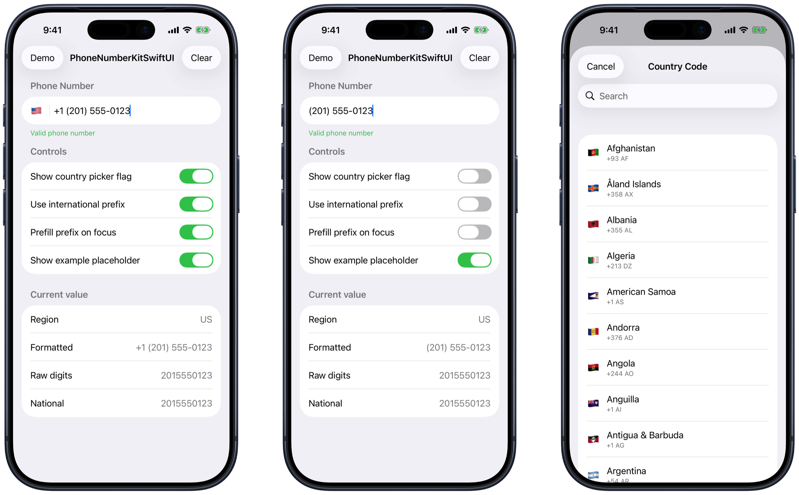

# PhoneNumberKitSwiftUI

PhoneNumberKitSwiftUI is a lightweight SwiftUI phone number field backed by [PhoneNumberKit](https://github.com/PhoneNumberKit/PhoneNumberKit). It gives iOS apps live phone number formatting, validation, optional international prefixes, example placeholders, and a searchable country picker with flag support while keeping the current formatted, raw, national, regional, and parsed values available from one observable store.



## Requirements

- iOS 17+
- Swift 6.2+
- PhoneNumberKit 5.0.2+

## Installation

Add the package with Swift Package Manager:

```swift
dependencies: [
    .package(url: "https://github.com/SwiftDevStudent/PhoneNumberKitSwiftUI.git", from: "1.0.2")
]
```

Then add `PhoneNumberKitSwiftUI` to your app target.

## Usage

```swift
import SwiftUI
import PhoneNumberKitSwiftUI

struct ContentView: View {
    @State private var phoneStore = PhoneNumberStore(
        withPrefix: true,
        withPrefixPrefill: true,
        withFlag: true
    )

    var body: some View {
        List {
            PhoneNumberField(store: phoneStore, title: "Phone number")

            if phoneStore.isValidNumber {
                Text("Valid phone number")
            }
        }
    }
}
```

`PhoneNumberStore` exposes formatted text, national digits, region, validation, and the parsed `PhoneNumberKit.PhoneNumber` value.

## Options

- `withPrefix`: Shows and formats the international calling code.
- `withPrefixPrefill`: Prefills the current region prefix when the field receives focus.
- `withFlag`: Shows a flag button that opens a SwiftUI country picker.
- `withExamplePlaceholder`: Uses PhoneNumberKit example numbers as the placeholder.
- `maxDigits`: Limits the national number length.

## Demo

See [Examples/PhoneNumberKitSwiftUIDemoView.swift](Examples/PhoneNumberKitSwiftUIDemoView.swift) for a compact demo screen with toggles, validation, and current value output.

## License

PhoneNumberKitSwiftUI is available under the MIT license. See [LICENSE](LICENSE).
